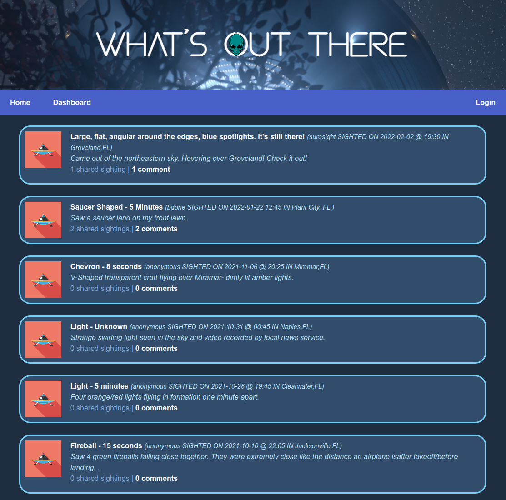

# whats-out-there

## Description

A Blog that allows users to post, view, share, and make comments about UFO sightings.

## Table Of Contents

- [whats-out-there](#whats-out-there)
  - [Description](#description)
  - [Table Of Contents](#table-of-contents)
  - [Local Installation (only if executing on local server/pc)](#local-installation-only-if-executing-on-local-serverpc)
  - [Usage for deployed Installation](#usage-for-deployed-installation)
  - [Usage for local Installation](#usage-for-local-installation)
  - [Operating The Web Application](#operating-the-web-application)
  - [About NUFORC Data](#about-nuforc-data)
  - [How To Bulk Load NUFORC Data](#how-to-bulk-load-nuforc-data)
  - [Technology Stack](#technology-stack)
  - [Future enhancements](#future-enhancements)
  - [Questions](#questions)

## Local Installation (only if executing on local server/pc)

To install locally, clone this repository to your local environment.  This is a node application, so node must be installed.  MySQL must also be installed locally.  For mySQL installation see https://dev.mysql.com/doc/refman/8.0/en/installing.html.  If you need to install node, check out this link  https://nodejs.org/en/download/.  Once mySQL and node (and npm) are installed, attach to the repository root directory and update npm dependencies with the following commands:

* npm install bcrypt dotenv
* npm install express express-handlebars express-session handlebars
* npm install mysql2 nodemon sequelize connect-session-sequelize
* npm install dtl-js node-csv

Additionally you must execute the a database initialization script.  Attach to the root directory of the repository and connect to mySQL, then type the source command...

mysql> source db/schema.sql

THIS SQL SCRIPT SHOULD ONLY BE RUN ONCE TO INITIALIZE THE MYSQL DATABASE/SCHEMA AS A FIRST-TIME SETUP.
  
LAST AND IMPORTANT...
  
In the root directory of the clone you must manually create a .env file.  It's not part of the repository for security purposes.  This file must consist of the following text:
  
DB_NAME=sightings_db
DB_USER=<the_mysql_user_name>
DB_PASSWORD=<password>

## Usage for deployed Installation

To execute the application using the Heroku deployed application, click the following link:

https://whats-out-there-stackattack.herokuapp.com/

Your browser tab should read "What's out there?", and the page should provide the application interface as pictured under the [Description](#description).

## Usage for local Installation

To execute the application locally, you have 3 command-line options.  From the root directory of the repository clone, type one of the following:

1.  *npm run start*           (starts the server and connects to the database)
2.  *npm run startover*       (starts the server and synchronizes database with sequelize models...all data lost)
3.  *npm run startseed*       (starts the server and synchronizes database with sequelize models...all data replaced with seed data)

The application interface will be available in your browser as:

http://localhost:3001

The application must remain running in the terminal until your done with it, at which time you can terminate it with a CTRL-C keystroke.

## Operating The Web Application

View the Demo...
  
  
https://user-images.githubusercontent.com/90280725/152453238-163b5ef3-327c-423e-9cdd-5dd09e8fcab8.mp4

## About NUFORC Data

The NUFORC data.world site provides a free download of UFO sighting data, and is used to initialize and add to our
UFO sighting database.  See the following link for more info, and download availability.
  
(https://data.world/ck30/ufo-data-nuforc)
  
There are over 111k sightings recored in the full download.  For this particular
project only 30k sightings were used based on some data quality filters (had to have a period at the end of the summary field), and then only the Florida sightings were picked out 
from there. The world.data NUFORC download is not updated regularily, none-the-less, the data is real, and a good starting point. 
  
The absence of consistent data providers was one of the primary motivating reasons for developing this app; to become a major contributor of data for UFO sightings.
  
This data, in it's downloaded format (CSV), can be loaded directly into the database using bulk-create functionality available in this application.

## How To Bulk Load NUFORC Data

From within the locally cloned directory, retrieve the downloaded NUFORC CSV file (ufo_data_nuforc.csv).  *It is strongly recommended that this data first be reduced significantly as described in* 
[About NUFORC Data](#about-nuforc-data).
  
The data sub-set should be renamed to sightings.csv.
That file name (sightings.csv) is the only name the bulk load process will recognize to use.
  
From the root directory, copy the sighting.csv file into the ./public/input directory.  Then log into the application from your web browser as the "anonymous" user.  If there is no anonymous user you'll have to signup as the anonymous user.  After creating an anonymous user, logout and login again as the anonymous user.  *This must be done* because it is the login process for the anonymous user that triggers the load of the sightings.csv file.  Upon completion of the process of logging in as the anonymous user, the sightings.csv file will be loaded.  Return to the home page and view your newly created data.
  
**NOTE:** The bulk-load process can be done with any data, however, the input file must be named "sightings.csv" and the format must be CSV with the following fields in the data and defined in the header record...
  
posted_date,occurrence_date,time,city,state,shape,duration,summary
    
The "posted_date" and "occurrence_date" **MUST** be in the format MM/DD/YY.  That's all the ETL process has been set up to handle. ETL will transform the dates into a sortable YYYY-MM-DD format.  This will enable the latest sightings to sort to the
top of the sighting list on the home page.
  
**ALSO NOTE:** Presently there is no ETL rule(s) setup to eliminate duplicates from being loaded into the database.  That is to be a future (but soon) enhancement.

## Technology Stack

This application is powered by NodeJS and a useful array of node package modules listed in the following:
  
    STYLING
    bulma ------------------------ styling
    handlebars ------------------- HTML Structure and Templating
  
    NODE SERVER
    express ---------------------- server APIs
    express-handlebars ----------- handlebars support
  
    ORM
    sequelize -------------------- Object Relational Mapping (to MySQL)
  
    COOKIE MANAGEMENT
    connect-session-sequelize ---- cookie/session management
    express-session --------------            "
  
    DATA PERSISTENCE
    mysql2 ----------------------- MySQL support
  
    SECURITY
    bcrypt ----------------------- encryption for securing passwords
    dotenv ----------------------- manage environment variables
  
    node-csv --------------------- working with CSV (Comma Separated Values) files
    realistic-structured-clone --- for archiving deep copies of our injested data objects
    dtl-js ----------------------- ETL (Extract Transform Load)  external data
    nodemon ---------------------- for automated RESTARTs of the node server as code changes

## Future enhancements

The details haven't been all worked out yet, but here's a list of critical enhancements that must be added for this
application to be a serious contributor:

1. Flexible sorting functionality starting with location and number of shared sightings.
2. Limits on the number of sightings listed on the home page.
3. Ability for sightings to be associated with images provided by users.
4. Have an Admin Page for data review and cleansing, bulk data loads, and User management.
5. Trigger verification email to users every time a sighting is posted or updated.
6. Handle multiple data formats from vetted data suppliers.
7. Provide sighting data extracts to external users.
8. (6) and (7) should be used to stimulate collaborative efforts for displaying and analizing UFO sighting data.

## Questions

Any questions, please contact Mark Dale.

Email address is: msdaledad@gmail.com
GitHub profile is https://github.com/msdale
